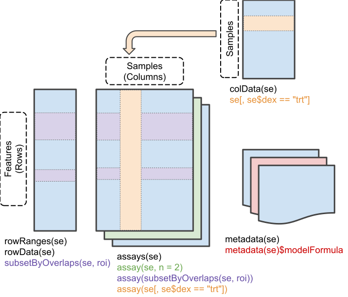

```{r setup, include=FALSE}
knitr::opts_chunk$set(
  echo = TRUE,
  cache = TRUE,
  collapse = TRUE,
  comment = "#>"
)

options(knitr.table.format = "html", knitr.kable.NA = '')
```

# Instructor names and contact information

* Marcel Ramos^[City University of New York, New York, NY, USA] ^[Roswell Park
Comprehensive Cancer Center, Buffalo, NY] (<marcel.ramos@roswellpark.org>)
* Ludwig Geistlinger^[City University of New York, New York, NY, USA]
* Levi Waldron^[City University of New York, New York, NY, USA]

# Workshop Description

This workshop demonstrates the facilities made available by companion packages,
`curatedTCGAData` and `TCGAutils`, to work with TCGA data. Built using the 
`MultiAssayExperiment` class, these packages make the management of multiple
assays easier and more efficient. The workshop also covers relevant data classes
such as `RaggedExperiment`, `SummarizedExperiment`, and
`RangedSummarizedExperiment`, which provide efficient and powerful
operations for representation of copy number, mutation, variant,
and expression data that are represented by different genomic ranges for each
specimen.

There is a built version of this workshop available at
http://rpubs.com/mramos/curatedTCGAWorkshop. The source is available at
https://github.com/waldronlab/curatedTCGAWorkshop.

Presentation slides are available at the link below:

```{r, eval = FALSE} 
browseURL("https://tinyurl.com/curatedTCGAWorkshop")
```

## Pre-requisites

* Basic knowledge of R syntax
* Familiarity with the GRanges and SummarizedExperiment classes
* Familiarity with 'omics data types including copy number and gene expression

## Workshop Participation

Participants will have a chance to build a `MultiAssayExperiment` object
from scratch, and will also work with more complex objects provided
by the `curatedTCGAData` package.

## R/Bioconductor packages used

To install the workshop dependencies, assuming you have already
[installed Bioconductor](https://www.bioconductor.org/install):

```{r, eval = FALSE}
if (!requireNamespace("BiocManager", quietly = TRUE))
    install.packages("BiocManager")

## Bioconductor 3.8 Stable Release
BiocManager::install(version = "3.8")
```


```{r, eval = FALSE}
BiocManager::install(
    c("org.Hs.eg.db", "mirbase.db", "EnsDb.Hsapiens.v86")
)

BiocManager::install(
    "waldronlab/curatedTCGAWorkshop",
    dependencies = TRUE,
    build_vignettes = TRUE
)
```

Note, the first line installs experimental data packages not installed
automatically by BiocManager.

Here is a list of Bioconductor packages required for this workshop:

* [curatedTCGAData](https://bioconductor.org/packages/curatedTCGAData)
* [MultiAssayExperiment](https://bioconductor.org/packages/MultiAssayExperiment)
* [SummarizedExperiment](https://bioconductor.org/packages/SummarizedExperiment)
* [GenomicRanges](https://bioconductor.org/packages/GenomicRanges)
* [RaggedExperiment](https://bioconductor.org/packages/RaggedExperiment)
* [TCGAutils](https://bioconductor.org/packages/TCGAutils)
* [UpSetR](https://bioconductor.org/packages/UpSetR)
* [mirbase.db](https://bioconductor.org/packages/mirbase.db)
* [EnsDb.Hsapiens.v86](https://bioconductor.org/packages/EnsDb.Hsapiens.v86)
* [org.Hs.eg.db](https://bioconductor.org/packages/org.Hs.eg.db)

```{r, eval = FALSE}
library(curatedTCGAData)
library(MultiAssayExperiment)
library(SummarizedExperiment)
library(GenomicRanges)
library(RaggedExperiment)
library(GenomicDataCommons)
library(TCGAutils)
library(UpSetR)
library(mirbase.db)
library(EnsDb.Hsapiens.v86)
library(org.Hs.eg.db)
library(readxl)
library(dplyr)
library(kableExtra)
```

```{r, echo = FALSE}
suppressPackageStartupMessages({
    library(curatedTCGAData)
    library(MultiAssayExperiment)
    library(SummarizedExperiment)
    library(GenomicRanges)
    library(RaggedExperiment)
    library(GenomicDataCommons)
    library(TCGAutils)
    library(UpSetR)
    library(mirbase.db)
    library(EnsDb.Hsapiens.v86)
    library(org.Hs.eg.db)
    library(readxl)
    library(dplyr)
    library(kableExtra)
})
```

## Time outline

2h total

| Activity                  | Time    |
|---------------------------|---------|
| Overview of key packages | 30 min |
| curatedTCGAData multi-assay dataset | 30 min |
| TCGAutils functionality | 30 min |
| Wrap-up and questions | ~ 30 min |


# Workshop goals and objectives

## Learning goals

* identify advantages of providing integrative data in a analysis-ready platform
* overview common data classes available in Bioconductor
* gain familiarity with available functionality in TCGAutils for the management
and coordination of TGCA data

## Learning objectives

* use curatedTCGAData to create on-the-fly TCGA MultiAssayExperiment datasets
* create a MultiAssayExperiment for TCGA or other multi'omics data
* explore functionality available in TCGAutils with curatedTCGAData objects

# Overview of key packages

## `curatedTCGAData`

Many tools exist for accessing and downloading The Cancer Genome Atlas (TCGA)
data. These include but are not limited to RTCGAToolbox, GenomicDataCommons
(package and website), TCGAbiolinks, cBioPortal, and Broad GDAC Firehose. These
tools encompass a spectrum of strengths in ease-of-use, integration, and
completeness of data. Few tools provide an integrative and user-friendly
representation of TCGA data in a widely used analysis platform such as
Bioconductor.

The `curatedTCGAData` experiment data package provides on-the-fly construction
of TCGA datasets for 33 different cancer types from the
[Broad GDAC Firehose](https://gdac.broadinstitute.org) pipeline.
Generally, it provides data using build `hg19`. `curatedTCGAData` facilitates
access and integration of TCGA data by providing multi-'omics data objects using
the `MultiAssayExperiment` data class. Where other platforms provide fragmented
datasets, `curatedTCGAData` ensures that all data provided is matched and
accounted for within the phenotypic metadata.

A list of available cancer types can be obtained from `TCGAutils::diseaseCodes`:

```{r}
data("diseaseCodes")
knitr::kable(diseaseCodes, align = "l", escape = FALSE,
    caption = "List of available cancer types from curatedTCGAData") %>%
    kableExtra::kable_styling(
        bootstrap_options = c("hover", "striped", "responsive"),
        full_width = FALSE
    )
```

```{r, echo=FALSE, cache=FALSE, message=FALSE, warning=FALSE}
knitr::read_chunk("dataTypesHTML.R")
```

```{r, echo=FALSE, cache=FALSE, message=FALSE, warning=FALSE}
<<loadTypes>>
```

A descriptive table of available 'omics types in `curatedTCGAData`
(thanks to Ludwig G. `@lgeistlinger`):

```{r}
## from dataTypesHTML.R
<<dataTypesTable>>
```


## `TCGAutils`

`TCGAutils` is a companion package that enhances `curatedTCGAData` by allowing
additional exploration and manipulation of samples and metadata in rows and
columns. 

Available operations in `TCGAutils` and `MultiAssayExperiment` enable
user-friendly operations for subsetting, separating, converting, and reshaping
of sample and feature TCGA data.

TCGAutils was developed specifically for TCGA data and for curatedTCGAData
products. It provides convenience / helper functions in three major areas:

1) conversion / summarization of row annotations to genomic ranges
2) identification and separation of samples
3) translation and interpretation of TCGA identifiers

along with additional reference data sets to explore TCGA data.

```{r, echo=FALSE, cache=FALSE, message=FALSE, warning=FALSE}
knitr::read_chunk("TCGAutils_cheatHTML.R")
```

```{r, echo=FALSE, message=FALSE, warning=FALSE}
<<cheatsheet>>
```

```{r}
## from TCGAutils_cheatHTML.R script
<<kable_utils>>
```

To better understand how it all fits together, this schematic shows the
relationship among all as part of the curatedTCGAData pipeline.

```{r, echo = FALSE, fig.cap = "Schematic of curatedTCGAData Pipeline"}
knitr::include_graphics("TCGAMAEPipeline20190204.png")
```

# Using Docker containers

Getting started with the proper installation of R and Bioconductor can
be tricky. 

| Bioconductor version | R Version |
|----------------------|-----------|
| `Bioc-release 3.8` | R release (`>= 3.5.0` and `< 3.6.0`) |
| `Bioc-devel 3.9`   | R devel (`>= 3.6.0`) |

How to install and manage different package version directories? 
See http://bioconductor.org/install/

*Alternatively*

We've made it easy to get started with the release or development version of
Bioconductor using Docker containers. Bioconductor regularly publishes
[docker images](http://bioconductor.org/help/docker/) for both Bioconductor
release and devel versions, we've created a script to load either image using
Docker.

Refer to the GitHub repository at
https://github.com/waldronlab/bioconductor_devel to use the images and skip
the management of installation directories and versioning.

# Major Data Classes

##`(Ranged)SummarizedExperiment`

```{r, echo = FALSE, fig.cap = "A matrix-like container where rows represent features of interest and columns represent samples. The objects contain one or more assays, each represented by a matrix-like object of numeric or other mode."}

```

`SummarizedExperiment` is the most important Bioconductor class for matrix-like
experimental data, including from RNA sequencing and micro array experiments. It
can store multiple experimental data matrices of identical dimensions, with
associated metadata on the rows/genes/transcripts/other measurements
(`rowData`), column/sample phenotype or clinical data (`colData`), and the
overall experiment (`metadata`). The derivative class
`RangedSummarizedExperiment` associates a `GRanges` or `GRangesList` vector with
the rows. These classes supersede the use of `ExpressionSet`. Note that many
other classes for experimental data are actually derived from
`SummarizedExperiment`.

## `RaggedExperiment`

`RaggedExperiment` is a flexible data representation for segmented copy number,
somatic mutations such as represented in `.vcf` files, and other ragged array
schema for genomic location data.  Like the `GRangesList` class from
`GenomicRanges`, `RaggedExperiment` can be used to represent _differing_ genomic
ranges on each of a set of samples. In fact, `RaggedExperiment` contains a
`GRangesList`:

```{r}
showClass("RaggedExperiment")
```

However, `RaggedExperiment` provides a flexible set of _Assay_ methods to
support transformation of such data to matrix format.

```{r, echo=FALSE, fig.cap="RaggedExperiment object schematic. Rows and columns represent genomic ranges and samples, respectively. Assay operations can be performed with (from left to right) compactAssay, qreduceAssay, and sparseAssay.", out.width="\\maxwidth"}
knitr::include_graphics("RaggedExperiment.png")
```

## `MultiAssayExperiment`

`MultiAssayExperiment` is an integrative container for coordinating multi-omics
experiment data on a set of biological specimens. As much as possible, its
methods adopt the same vocabulary as `SummarizedExperiment`. A
`MultiAssayExperiment` can contain any number of assays with different
representations. Assays may be *ID-based*, where measurements are indexed
identifiers of genes, microRNA, proteins, microbes, etc.  Alternatively, assays
may be *range-based*, where measurements correspond to genomic ranges that can
be represented as `GRanges` objects, such as gene expression or copy number.
For ID-based assays, there is no requirement that the same IDs be
present for different experiments.  For range-based assays, there is also
no requirement that the same ranges be present for different experiments;
furthermore, it is possible for different samples within an experiment to be
represented by different ranges.  The following data classes have been tested 
to work as elements of a `MultiAssayExperiment`:

1. `matrix`: the most basic class for ID-based datasets, could be used for
example for gene expression summarized per-gene, microRNA, metabolomics, or
microbiome data.
2. `SummarizedExperiment` and derived methods: described above, could be used 
for miRNA, gene expression, proteomics, or any matrix-like data where
measurements are represented by IDs.
3. `RangedSummarizedExperiment`: described above, could be used
for gene expression, methylation, or other data types referring to genomic
positions.
4. `ExpressionSet`: Another rich representation for ID-based datasets, supported
only for legacy reasons
5. `RaggedExperiment`: described above, for non-rectangular (ragged) ranged-based datasets
such as segmented copy number, where segmentation of
copy number alterations occurs and different genomic locations in each sample.
6. `RangedVcfStack`: For VCF archives broken up by chromosome (see `VcfStack`
class defined in the `GenomicFiles` package)
7. `DelayedMatrix`: An on-disk representation of matrix-like objects for large
datasets. It reduces memory usage and optimizes performance with delayed
operations. This class is part of the `DelayedArray` package.

Note that any data class extending these classes, and in fact any data class
supporting row and column names and subsetting can be used as an element of a
`MultiAssayExperiment`.

```{r, echo = FALSE, fig.cap="MultiAssayExperiment object schematic. colData provides data about the patients, cell lines, or other biological units, with one row per unit and one column per variable. The experiments are a list of assay datasets of arbitrary class.  The sampleMap relates each column (observation) in ExperimentList to exactly one row (biological unit) in colData; however, one row of colData may map to zero, one, or more columns per assay, allowing for missing and replicate assays. sampleMap allows for per-assay sample naming conventions. Metadata can be used to store information in arbitrary format about the MultiAssayExperiment. Green stripes indicate a mapping of one subject to multiple observations across experiments.", out.width="\\maxwidth"}
knitr::include_graphics("MultiAssayExperiment.png")
```

# Working with MultiAssayExperiment

## API cheat sheet

```{r cheatsheet, echo = FALSE, fig.cap = "The MultiAssayExperiment API for construction, access, subsetting, management, and reshaping to formats for application of R/Bioconductor graphics and analysis packages.", out.width="\\maxwidth"}
knitr::include_graphics("MultiAssayExperiment_cheatsheet.png")
```

### Building a MultiAssayExperiment from scratch

To start from scratch building your own MultiAssayExperiment, see the package
[Coordinating Analysis of Multi-Assay Experiments vignette](https://bioconductor.org/packages/release/bioc/vignettes/MultiAssayExperiment/inst/doc/MultiAssayExperiment.html).
The package [cheat sheet](https://bioconductor.org/packages/release/bioc/vignettes/MultiAssayExperiment/inst/doc/MultiAssayExperiment_cheatsheet.pdf) is also helpful.

If anything is unclear, please ask a question at
https://support.bioconductor.org/ or create an issue on the
[MultiAssayExperiment](https://github.com/waldronlab/MultiAssayExperiment/issues)
or the [curatedTCGAData](https://github.com/waldronlab/curatedTCGAData/issues)
issue tracker.

# The Cancer Genome Atlas (TCGA) as MultiAssayExperiment objects

Most unrestricted TCGA data are available as MultiAssayExperiment objects from
the `curatedTCGAData` package. This represents a lot of harmonization!

```{r}
curatedTCGAData("ACC")
suppressMessages({
    (acc <- curatedTCGAData("ACC",
        assays = c("miRNASeqGene", "RPPAArray", "Mutation",
            "RNASeq2GeneNorm", "CNVSNP", "GISTIC"), dry.run = FALSE))
})
```

_Note_. Methylation files will differ depending on Bioconductor version
(release vs devel)

## Important clinical information

These objects contain most unrestricted TCGA assay and clinical / pathological
data, as well as material curated from the supplements of published TCGA primary
papers at the end of the colData columns:

```{r}
dim(colData(acc))
tail(colnames(colData(acc)), 10)
```

The `TCGAutils::getClinicalNames` function will display relevant clinical column
names obtained from `RTCGAToolbox` that are also commonly found in other cancer
types.

```{r}
(acccol <- getClinicalNames("ACC"))

all(acccol %in% names(colData(acc)))

head(colData(acc)[, acccol])
```

Reference documentation in Firehose Broad GDAC:

```{r, eval=FALSE}
browseURL("https://dx.doi.org/10.7908/C1RX9BD4")
```

## Subtype Information

Using `TCGAutils`, `getSubtypeMap` shows the user the column names associated
with published subtype information.

```{r}
getSubtypeMap(acc)

(subtypeCols <- getSubtypeMap(acc)[["ACC_subtype"]])

## for older versions of TCGAutils
subtypeCols <- gsub("SAMPLE", "patientID", subtypeCols)

colData(acc)[, make.names(subtypeCols)]
```


## Pan-Cancer Data

`curatedTCGAData` works to build datasets on-the-fly including Pan-Cancer
datasets where assays from two or more particular cancer types need to be
combined. Here we demonstrate a Pan-Cancer `MultiAssayExperiment` using
ovarian and breast cancer data.

```{r, eval = FALSE}
(
ovbrca <- curatedTCGAData(diseaseCode = c("OV", "BRCA"),
    assays = c("RNA*", "Mutation"), dry.run = FALSE)
)
```

```{r, echo=FALSE}
suppressMessages({
    ovbrca <- curatedTCGAData(diseaseCode = c("OV", "BRCA"),
        assays = c("RNA*", "Mutation"), dry.run = FALSE)
})
ovbrca
```


# `TCGAutils` functionality

Aside from the available reshaping functions already included in the
`MultiAssayExperiment` package, the `r BiocStyle::Biocpkg("TCGAutils")` package
provides additional helper functions for working with TCGA data.

## "Simplification" of `curatedTCGAData` objects

A number of helper functions are available for managing datasets from
`curatedTCGAData`. These include:

### Conversions of `SummarizedExperiment` to `RangedSummarizedExperiment` based
on `TxDb.Hsapiens.UCSC.hg19.knownGene` for:

#### `mirToRanges` for microRNA

```{r}
mirToRanges(acc)
```

*Note about microRNA*: You can set ranges for the microRNA assay according to
the genomic location of those microRNA, or the locations of their predicted
targets, but we don't do it here. Assigning genomic ranges of microRNA targets
would be an easy way to subset them according to their targets.

#### `symbolsToRanges` for gene symbols 

```{r}
symbolsToRanges(acc)
```

#### `qreduceTCGA` for mutation and copy number

`qreduceTCGA` can convert `RaggedExperiment` objects to
`RangedSummarizedExperiment` with one row per gene symbol, for:
    - segmented copy number datasets ("CNVSNP" and "CNASNP")
    - somatic mutation datasets ("Mutation"), with a value of 1 for any
    non-silent mutation and a value of 0 for no mutation or silent mutation

```{r}
genome(acc[["ACC_Mutation-20160128"]]) <-
    vapply(
        X = genome(acc[["ACC_Mutation-20160128"]]),
        FUN = TCGAutils::translateBuild,
        FUN.VALUE = character(1L)
    )

seqlevelsStyle(acc[["ACC_Mutation-20160128"]]) <- "UCSC"

seqlevelsStyle(acc[["ACC_Mutation-20160128"]])

rowRanges(acc[["ACC_Mutation-20160128"]])

qreduceTCGA(acc[ , , "ACC_Mutation-20160128"])
```


#### `simplifyTCGA` - combine all

The `simplifyTCGA` function combines all of the above operations to create
a more managable `MultiAssayExperiment` object and using
`RangedSummarizedExperiment` assays where possible.

```{r, eval = FALSE}
(simpa <- TCGAutils::simplifyTCGA(acc))
```


### Identification and separation of samples

What types of samples are in the data?

**Solution**

The `sampleTables` function gives you an overview of samples in each assay:

```{r}
sampleTables(acc)

head(sampleTypes)
```

How can I separate tumor from normal samples? 

**Solution**

The `splitAssays` function will separate assay datasets into samples
based on TCGA barcode identifiers.

```{r}
splitAssays(acc)
```


### Translation and Interpretation of TCGA barcodes

`TCGAutils` provides a number of ID translation functions.
These allow the user to translate from either file or case UUIDs to TCGA
barcodes and back. These functions work by querying the Genomic Data Commons API
via the `GenomicDataCommons` package (thanks to Sean Davis for original
template). These include: 

* `UUIDtoBarcode()`

```{r}
UUIDtoBarcode("ae55b2d3-62a1-419e-9f9a-5ddfac356db4", from_type = "case_id")
```

* `barcodeToUUID()`

```{r}
(xcode <- head(colnames(acc)[["ACC_Mutation-20160128"]], 4))
barcodeToUUID(xcode)
```

* `UUIDtoUUID()`

```{r}
head(UUIDtoUUID("ae55b2d3-62a1-419e-9f9a-5ddfac356db4", to_type = "file_id"))
```

* `filenameToBarcode()`

```{r, eval=FALSE}
library(GenomicDataCommons)
fquery <- files(legacy = TRUE) %>%
    GenomicDataCommons::filter(~ cases.project.project_id == "TCGA-ACC" &
        data_category == "Gene expression" &
        data_type == "Exon quantification")

fnames <- results(fquery)$file_name[1:6]

filenameToBarcode(fnames)
```

See the `r BiocStyle::Biocpkg("TCGAutils")` help pages for details.

## Other TCGA data types

Helper functions to add TCGA exon files (from legacy archive), copy number and 
GISTIC copy number calls to MultiAssayExperiment objects are also available in
`r BiocStyle::Biocpkg("TCGAutils")`.

# Plotting, correlation, and other analyses

## How many samples have data for each combination of assays?

**Solution**

The built-in `upsetSamples` creates an "upset" Venn diagram to answer this
question:

```{r, eval = FALSE}
upsetSamples(acc)
```

In this dataset only 44 samples have all 5 assays, 33 are missing 
RNA gene expression data, 2 are missing reverse-phase protein array (RPPA),
12 have only mutations and RPPA, etc.

## Kaplan-meier plot stratified by pathology_N_stage

Create a Kaplan-meier plot, using pathology_N_stage as a stratifying variable.

**Solution**

The colData provides clinical data for things like a Kaplan-Meier plot for
overall survival stratified by nodal stage.

```{r, eval = FALSE}
library(survival)
Surv(acc$days_to_death, acc$vital_status)
```

And remove any patients missing overall survival information:
```{r, eval = FALSE}
accsurv <- acc[, complete.cases(acc$days_to_death, acc$vital_status), ]
```

```{r, eval = FALSE}
library(survminer)

fit <- survfit(Surv(days_to_death, vital_status) ~ pathology_N_stage, data = colData(accsurv))
ggsurvplot(fit, data = colData(accsurv), risk.table = TRUE)
```

## Multivariate Cox regression including RNA-seq, copy number, and pathology

Choose the *EZH2* gene for demonstration. This subsetting will drop assays with
no row named EZH2:

```{r, eval = FALSE}
wideacc <- wideFormat(acc["EZH2", , ],
    colDataCols=c("vital_status", "days_to_death", "pathology_N_stage"))

wideacc$y <- Surv(wideacc$days_to_death, wideacc$vital_status)

head(wideacc)
```

Perform a multivariate Cox regression with *EZH2* copy number (gistict),
log2-transformed *EZH2* expression (RNASeq2GeneNorm), and nodal status
(pathology_N_stage) as predictors:

```{r, eval = FALSE}
coxph(
    Surv(days_to_death, vital_status) ~
        gistict_EZH2 + log2(RNASeq2GeneNorm_EZH2) + pathology_N_stage,
    data=wideacc
)
```

We see that *EZH2* expression is significantly associated with overal survival
(p < 0.001), but *EZH2* copy number and nodal status are not. This analysis
could easily be extended to the whole genome for discovery of prognostic
features by repeated univariate regressions over columns, penalized multivariate
regression, etc.

For further detail, see the main MultiAssayExperiment vignette.

<p style="text-align: right;"> [back to top](#overview-of-key-packages) </p>

# Citing MultiAssayExperiment

```{r}
citation("MultiAssayExperiment")
```

# Session Info

```{r}
sessionInfo()
```

